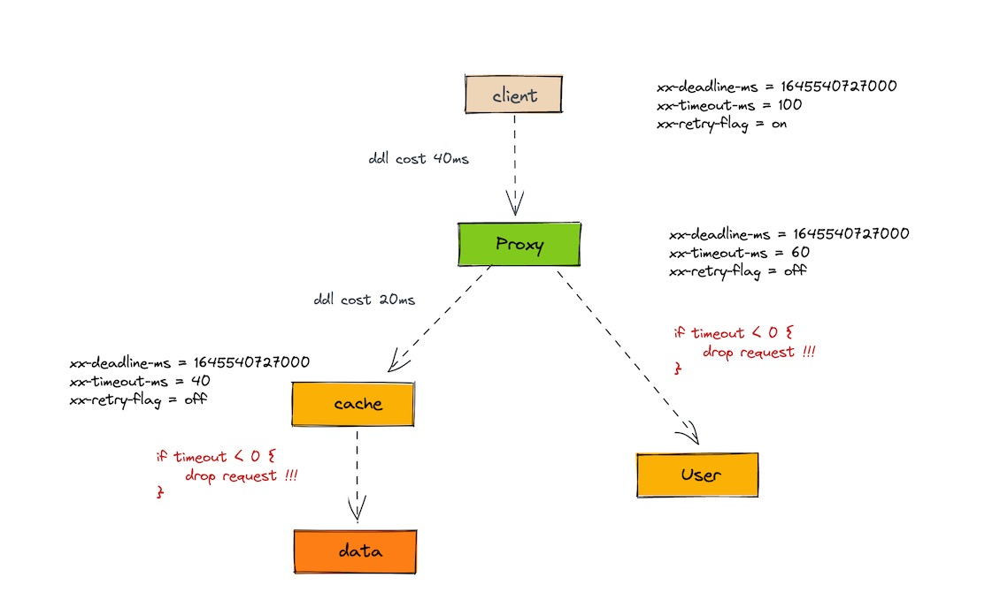

## go-infector

control timeout and retry in distributed microservice !!!

**feature:**

- easy api
- gin interceptor
- grpc interceptor
- http middleware
- redis hook

### Usage

...

### Example

request trace:

> client -> proxy -> user

[easy full example](github.com/rfyiamcool/go-infector/example)
